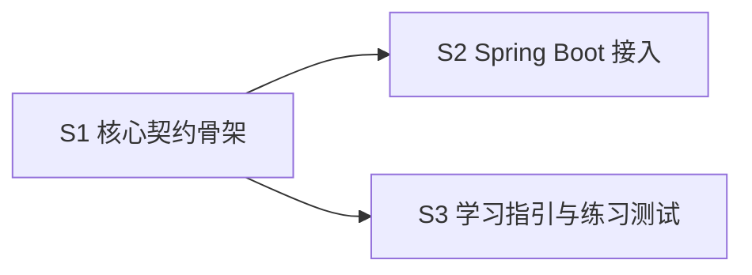

# 幂等 Starter 骨架实现计划

**目标**：交付可运行的学习骨架，并保留三个由学习者完成的核心实现。
**设计来源**：`docs/design/spec/idempotent-starter-spec.md`
**需求澄清 Gate**：NOT_REQUIRED，证据 `docs/requirements/analysis/idempotent-starter-analysis.md`
**涉及服务/模块**：`idempotent-core`、`idempotent-spring-boot-starter`、`idempotent-example`
**执行 Skill**：`dw-code-implementation`

## 项目上下文

- 基础包和分层：新项目，使用 `io.github.lonelyjojos.idempotent`。
- 可复用能力：仓库无既有 Java 代码。
- 下游契约：无跨服务依赖。
- 标准术语：NONE。
- 约束与 ADR：NONE。

## 验收标准覆盖

| AC | 可观察行为 | Slice | 验证证据 |
|---|---|---|---|
| AC-1 | 全项目可编译测试 | S1 | `mvn test` |
| AC-2 | Starter 自动配置可加载 | S2 | 示例启动与自动配置文件 |
| AC-3 | 核心练习边界明确 | S3 | TODO 清单与禁用契约测试 |

## Slice DAG

| Wave | Frontier | 进入条件 |
|---|---|---|
| 1 | S1 | 无 blocker |
| 2 | S2、S3 | 核心公共签名可编译 |

## Blocking edges

| From | To | 被提供的具体产物/契约 | 完成证据 |
|---|---|---|---|
| S1 | S2 | 执行器、命令和仓储公共签名 | core 编译通过 |
| S1 | S3 | 可被契约测试调用的公共入口 | 测试源码编译通过 |

## External gates

不涉及。

## 文件所有权矩阵

| 文件 | Slice | Wave | Owner/处理方式 |
|---|---|---|---|
| 根 `pom.xml` | S1、S2 | 1、2 | 先定义模块，再补依赖，串行修改 |
| `README.md` | S3 | 2 | S3 独占 |

## S1：核心契约骨架

**交付行为**：业务代码可以构造幂等命令并调用统一执行入口。
**Blocked by**：None — can start immediately
**File conflicts**：根 `pom.xml` 由本切片先建立。
**非目标**：不实现核心算法。

### Slice Context Pack

- 标准术语：幂等键表示一次业务操作的唯一身份。
- 有效 ADR：NONE。
- 契约证据：Spec 2.4。

### 验收标准

- [ ] 核心模块无 Spring 依赖。
- [ ] 公共参数校验测试通过。

### 实现契约

| 层/边界 | 文件 | 决策或签名 |
|---|---|---|
| API | `IdempotentExecutor.java` | `execute(command, action)` |
| Domain | `IdempotentCommand.java` | namespace、key、ttl |
| Data | `IdempotentRepository.java` | 抢占、成功、释放 |

### 测试与验证

- Test seam：`IdempotentCommand`。
- Independent oracle：Spec AC-1。
- Red 或 mutation：非法 TTL 必须被拒绝。
- 目标命令：`mvn -pl idempotent-core test`。
- 集成验证：父工程 Reactor 构建。

### 可观测性与回滚

- Hubble：当前不涉及。
- 日志关联字段：storageKey。
- 回滚/兼容：删除新项目目录即可，不影响现有学习内容。

### 完成证据

- [ ] 编译通过
- [ ] 目标测试真实运行且通过
- [ ] 验收标准逐项有证据
- [ ] 未引入计划外公共契约

## S2：Spring Boot 接入

**交付行为**：业务项目引入 Starter 后可以使用 `@Idempotent`。
**Blocked by**：S1 — 依赖核心公共签名。
**File conflicts**：根 `pom.xml` 按依赖边串行。
**非目标**：不实现 SpEL 核心解析。

### Slice Context Pack

- 标准术语：Starter 表示包含自动配置和必要依赖的接入包。
- 有效 ADR：NONE。
- 契约证据：Spec AC-2。

### 验收标准

- [ ] 自动配置候选文件存在。
- [ ] 示例应用可以加载 Starter Bean。

### 实现契约

| 层/边界 | 文件 | 决策或签名 |
|---|---|---|
| API | `Idempotent.java` | key、namespace、ttlSeconds |
| Domain | `IdempotentAspect.java` | 将方法调用转换为命令 |
| Framework | `IdempotentAutoConfiguration.java` | 支持业务方覆盖默认 Bean |

### 测试与验证

- Test seam：示例应用启动入口。
- Independent oracle：Spring 自动配置候选可发现。
- Red 或 mutation：删除 imports 文件时自动配置应不可发现。
- 目标命令：`mvn -pl idempotent-example -am test`。
- 集成验证：启动示例应用。

### 可观测性与回滚

- Hubble：当前不涉及。
- 日志关联字段：无。
- 回滚/兼容：`idempotent.enabled=false` 可关闭自动配置。

### 完成证据

- [ ] 编译通过
- [ ] 目标测试真实运行且通过
- [ ] 验收标准逐项有证据
- [ ] 未引入计划外公共契约

## S3：学习指引与练习测试

**交付行为**：学习者能按明确顺序完成三个核心练习并独立验证。
**Blocked by**：S1 — 测试依赖核心公共入口。
**File conflicts**：无。
**非目标**：不提供练习答案。

### Slice Context Pack

- 标准术语：契约测试用于描述组件行为，不规定具体算法。
- 有效 ADR：NONE。
- 契约证据：Spec AC-3。

### 验收标准

- [ ] `rg "TODO learner"` 能找到三个核心练习。
- [ ] 每个练习至少有一个默认禁用的测试。
- [ ] README 给出启用和验证顺序。

### 实现契约

| 层/边界 | 文件 | 决策或签名 |
|---|---|---|
| Guide | `README.md` | 环境、练习顺序、命令 |
| Test | `*Test.java` | 默认禁用，完成后逐项启用 |
| Example | `OrderController.java` | 演示注解调用方式 |

### 测试与验证

- Test seam：三个公共核心入口。
- Independent oracle：Spec 中的重复执行和失败重试行为。
- Red 或 mutation：启用测试后未完成实现必须失败。
- 目标命令：`mvn test`。
- 集成验证：README 命令可复制执行。

### 可观测性与回滚

- Hubble：当前不涉及。
- 日志关联字段：无。
- 回滚/兼容：文档与测试均局限在新项目。

### 完成证据

- [ ] 编译通过
- [ ] 目标测试真实运行且通过
- [ ] 验收标准逐项有证据
- [ ] 未引入计划外公共契约

## Plan Gate

状态：PASS

| 指标 | 数量 |
|---|---:|
| 未映射 AC | 0 |
| 纯横向切片 | 0 |
| 依赖环 | 0 |
| 无理由 blocking edge | 0 |
| 无 owner 文件冲突 | 0 |
| OPEN Decision Gate | 0 |
| 无 owner External Gate | 0 |

当前 frontier：S1。

